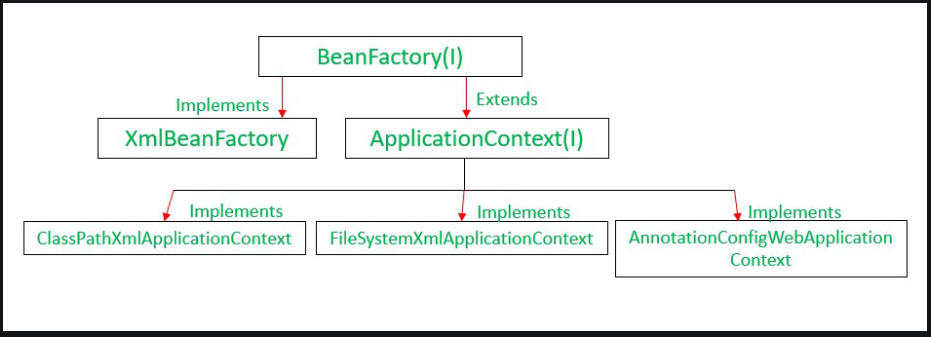

## prgm: Understanding of IoC container
## prgm1: Spring – BeanFactory
## read: ApplicationContext  (https://www.geeksforgeeks.org/spring-applicationcontext/)
## Spring – Difference Between BeanFactory and ApplicationContext

## prgm2: Dependency Injection.